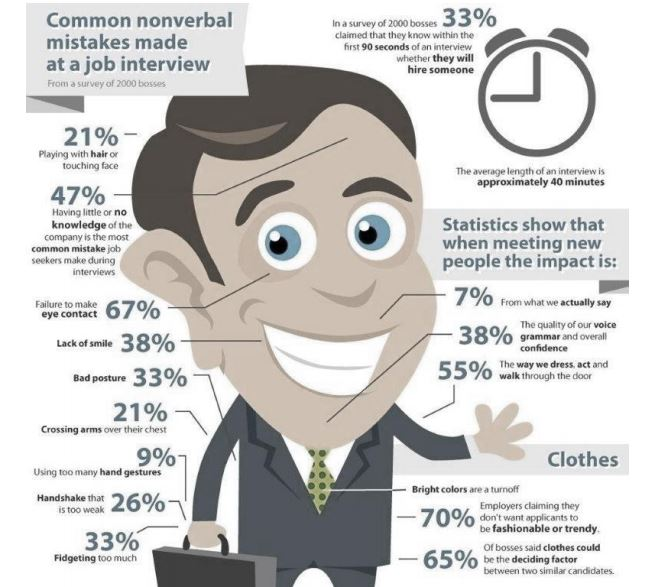

***

    <h1>Prepare for Interviews</h1>

***

    

***

    <h2>Q & A</h2>

***

1- __Tell me about your self?__  

 * __Tip:__ Focus on your work abilities and use key words like:  
  "HARD WORKING", "ENTHUSIASTIC", "COMMITTED" and "PROFESIONAL"

1. You should hire me becouse I will learn the job quickly and I will start contributing positively to the team as fast a time as possible.

2- __Why do you want to work for us?__  

1. Because of the fact that you have exciting plans for the future and i would like to be part of that.
2. You also have a strong reputation in the industry.
3. I feel that me skills, qualities and attributes will be put to good use working for you.

3- __What ar your strenghts?__  

* __Tip:__ Read the job advert and match your strengths to the ones listed there!

1. MY ability to take on and complete multiple tasks whilst under pressure.
2. My ability to put customer first and you understand how to important custormer service is to the success o the company.

4- __What'is your biggest wekneess?__

1. I have been criticized before for my inability to say no to people. I', usually the first person to volunteer to the additional tasks and I sometimes get overloaded with work.

5- __Where do you see yourself in 5 years time?__

1. I expect to be competent in the role and well-respected by my work colleagues, suppervisors and peers.
2. I will also be willing to help train up other people in similar roles to myself due to the length of the time you will bhave been in the position and the experience you would have gained.

6- __Why do you like to leave your job?__  
* __Tip:__ DO NOT, under any circumstances, criticize or be disrespectful to either your work colleagues or manager.

1. I am now ready for a new chanllenge where my skills and quilites will be put to good use. 
2. I will leave on good terms and with fond memories of the great things you achieved whilst with your previous employer.

7- __When you have delivered grat customer service?__  
* __Tip:__ SITUATION, TASK, ACTION and RESULT.

1. Whilst working in a previous job, I helped a customer who was having problem choosing a product specific to their needs. I spent time explaining the procucts we had available, and which ones in my opinon would be most suited to their needs.
2. Once I had finished helping the customer, they thanked me for the time I had taken ensuring they got the right products and they then went away and left a positive review online.

8- __What would you do if you did not get on tiht someone in your team?__  
* __Tip:__ 

1. Be the better person and say you would tackle the situation with a view tho resolving any conflict quickly. 

***